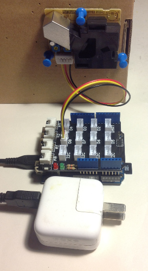

# Arduino + SmartAirFilter 制作智能感应的 PM 空气净化器 #

## 先说 SmartAirFilters

知道 [SmartAirFilters](http://smartairfilters.com/zh.html) 源自微博上转发的很火的那个帖子，和动辄七八千元的商用产品比，几百元的 SmartAirFilters(以下简称电扇) 确实不贵。一次和朋友在清华科技园里附近的咖啡馆聊天，正好遇见他们在那里做 DIY 体验工坊，作为 DIYer 爱好者，理所应当给个赞，就败了个 1.0 试一试。

## 空气 PM 的监控

空气过滤效果到底如何？作为数据控，理所应当必须看数据说话。正好在玩 Arduino Yun，就起意搞个灰尘传感器监控一下。

### 设备清单

要搞定空气中的 PM 值检测，网上已经有文章珠玉在前, [英文原文](http://www.howmuchsnow.com/arduino/airquality/) 和[中文翻译](http://blog.yeelink.net/?p=184)在此。我使用的设备也类似：

* Arduino Yun
* Shinyei 粉尘检测传感器 PPD42NS
* Grove Base Shield（可选）
* Micro USB 电源（输出为 5V 0.5A 左右即可）

这里需要说明的是，目前类似 PPD42NS 的这类微型的空气 PM 检测传感器都是利用光学特性，计算一段时间内观测到的粉尘**数量**，从而推算出每立方米此类粉尘的**数量**。而严格意义上的 PM 1.0/2.5 是以每立方米此类粉尘的**重量**计量的。这两个数据具有较大的相关性，对在日常生活中了解 PM 值的需要来说，PPD42NS 已经能够满足要求。

因为有 Grove Base Shield，连接电路很简单，将 Grove Base Shield 插到 Arduino 上，然后将 PPD42NS 的接口插到 D8 槽即可。PPD42NS 需竖直放置。

如果您没有 Grove Base Shield，请按以下连接：

    PPD42NS      | Arduino |
    -------      | ------- |
    Pin 1 (黑线) | GND     |
    Pin 3 (红线) | 5VDC    |
    Pin 4 (黄线) | D8      |

### Arduino 代码

完整代码请参考 Git 上的 dust_check_simple 部分。

    /*
    # Smart Air Control #

    Program by Iasc CHEN，April 2014

    ## Grove Dust Sensor ##

    Use Shinyei Model PPD42NS Particle Sensor
    http://www.sca-shinyei.com/pdf/PPD42NS.pdf

    JST Pin 1 (Black Wire)  => Arduino GND
    JST Pin 3 (Red wire)    => Arduino 5VDC
    JST Pin 4 (Yellow wire) => Arduino Digital Pin 8
    */

    #include <Bridge.h>

    // dust check
    int DUST_PIN = 8;

    unsigned long DUST_SAMPLE_MS = 15000;//sampe 15s ;

    unsigned long duration, starttime, now, lowpulseoccupancy = 0;
    float ratio = 0, concentration = 0;

    void setup() {
        Bridge.begin();
        Console.begin();
        // Serial.begin(9600);

        pinMode(DUST_PIN, INPUT);
        starttime = millis(); //get the current time;

        // while(!Console);
        Console.println(" Time , PM ");
    }

    void loop() {
        duration = pulseIn(DUST_PIN, LOW);
        lowpulseoccupancy = lowpulseoccupancy + duration;
        now = millis();

        if ((now - starttime) > DUST_SAMPLE_MS) {
            ratio = lowpulseoccupancy / (DUST_SAMPLE_MS * 10.0);  // Integer percentage 0=>100
            concentration = 1.1 * pow(ratio, 3) - 3.8 * pow(ratio, 2) + 520 * ratio + 0.62; // using spec sheet curve

            Console.print(now/1000);
            Console.print(",");
            Console.println(int(concentration/100));

            lowpulseoccupancy = 0;
            starttime = millis();
        }
    }
    
从 Console 中得到未开电扇的一小时输出数据如下，数据文件在此 [pm_no_filter.csv](../data/pm_no_filter.csv)。

其数据图形如下，经过一小时，PM 值缓慢的从平均约 80，降到约 40：

## 能更 Smarter 一些吗？

在封闭的室内，当空气过滤达到一定水平之后，PM 值基本稳定。此时如果仍然开着净化器，也只是白白耗电。我们可以设定一下阈值，例如，PM 指数高于 50，自动打开净化器；低于 20，自动关闭净化器，就比 Smart 更 Smarter 了 。

这个功能可以通过 Arduino 控制继电器来实现。

### 设备清单

* Arduino Yun
* Shinyei 粉尘检测传感器 PPD42NS
* Grove Base Shield（可选）
* Micro USB 电源（输出为 5V 0.5A 左右即可）
* 继电器模块，能够控制 200V，10A 电路
* 插座

继电器的引脚连接说明如下：

    Relay       | Arduino |
    -------     | ------- |
    Pin 1 (GND) | GND     |
    Pin 2 (VSS) | 5VDC    |
    Pin 3 (SIG) | D4      |

插座的改造工作是用继电器替换原有的控制开关。具体操作步骤是：

1 将原有的开关盖子取出
2 从开关的两极焊接引出两根线（感谢 @我是国宝 帮助焊接）
3 将这两根线接到继电器上的控制引脚上

在上图中中间那个插座用于给 Arduino Yun 供电。左侧的插座，在其开关位置连出的两根线接到了继电器上，下面的插头是电扇用的。

### Arduino 代码

我在 Arduino 代码中增加了对继电器的控制，代码修改如下，完整代码请参考 Git 上的 dust_check 部分。：
	
    /*
    # Smart Air Control #

    Program by Iasc CHEN，April 2014

    ## Grove Dust Sensor ##

    Use Shinyei Model PPD42NS Particle Sensor
    http://www.sca-shinyei.com/pdf/PPD42NS.pdf

    JST Pin 1 (Black Wire)  => Arduino GND
    JST Pin 3 (Red wire)    => Arduino 5VDC
    JST Pin 4 (Yellow wire) => Arduino Digital Pin 8

    ## Relay ##

    Relay Pin 1 (Black Wire)=> Arduino GND
    Relay Pin 2 (Red wire)  => Arduino 5VDC
    Relay Pin 3 (Green wire)=> Arduino Digital Pin 4
    */

    #include <Bridge.h>

    float RELAY_ON_VALUE  = 5000;
    float RELAY_OFF_VALUE = 2000;

    // dust check
    int DUST_PIN = 8;

    unsigned long DUST_SAMPLE_MS = 15000;//sampe 15s ;

    unsigned long duration, starttime, lowpulseoccupancy = 0;
    float ratio = 0, concentration = 0;

    //relay control
    int RELAY_PIN = 4;
    unsigned long MAX_RELAY_RUNNING_MS = 1200000;// If after 1200s the air filter are still running, send a warning;

    bool relay_on = false;
    unsigned long now, relay_start_time, relay_running_time = 0;

    void setup() {
        Bridge.begin();
        Console.begin();
        //Serial.begin(9600);

        pinMode(DUST_PIN,INPUT);
        starttime = millis(); //get the current time;

        pinMode(RELAY_PIN, OUTPUT);
        relay_start_time = millis();

        // while(!Console);
        Console.println("Time , PM , Status , Running");
    }

    void loop() {
        duration = pulseIn(DUST_PIN, LOW);
        lowpulseoccupancy = lowpulseoccupancy + duration;
        now = millis();

        if ((now - starttime) > DUST_SAMPLE_MS)//if the sampel time == 30s{

            ratio = lowpulseoccupancy / (DUST_SAMPLE_MS * 10.0);  // Integer percentage 0=>100
            concentration = 1.1 * pow(ratio,3) - 3.8 * pow(ratio,2) + 520 * ratio + 0.62; // using spec sheet curve

            Console.print(now/1000);
            Console.print(" , ");
            Console.print(int(concentration/100));
            Console.print(" , ");

            if (concentration < RELAY_OFF_VALUE){
                if(relay_on){
                    digitalWrite(RELAY_PIN, LOW);
                    relay_on = false;
                }
            } else if (concentration > RELAY_ON_VALUE){
                if(! relay_on){
                    digitalWrite(RELAY_PIN, HIGH);
                    relay_on = true;

                    relay_start_time = millis();
                }
            }

            if(relay_on){
                relay_running_time = now - relay_start_time ;

                Console.print(" ON , ");
                Console.println( relay_running_time / 1000 );

                // if (relay_running_time > MAX_RELAY_RUNNING_MS){
                //      Console.println(" => Make sure your doors and windows are closed, or Change Filter!");
                // }
            }
            else{
                Console.print(" OFF , ");
                Console.println( 0 );
            }

            lowpulseoccupancy = 0;
            starttime = millis();
        }
    }

## 将 PM 数值记录在 Log 文件中

前面的 PM 记录都是输出在 Console 中的，让我们增加上 log 记录，这样就可以长时间记录家里的空气 PM 值了。

下面的代码实验的性质较大，不仅仅是为了写 log 文件，还验证了 Arduino 调用 Shell 命令的过程。这样的方法便于将 Arduino Sketch 变成一个能 “推Push“ 的数据源使用，可以将更多地工作放到 Python 或 Shell 中去，提升开发效率。

### 设备清单

设备同上。

### Arduino 代码

以下内容是部分相关的代码，完整代码请参考 Git 上的 dust_check_log 部分。

首先，增加了用于创建所需的 Shell 脚本的部分，在使用时，请根据您的环境修改文件目录和名字：

    #include <FileIO.h>

    void uploadScript() {
        File script = FileSystem.open("/mnt/sda1/workspaces/dust_check/dust_log.sh", FILE_WRITE);
        script.print("#!/bin/sh\n");
        script.print("echo $(date +'%Y-%m-%d %H:%M:%S') , $1 >> /mnt/sda1/workspaces/dust_check/logs/dust.log");
        script.close();

        Process chmod;
        chmod.begin("chmod");      // chmod: change mode
        chmod.addParameter("+x");  // x stays for executable
        chmod.addParameter("/mnt/sda1/workspaces/dust_check/dust_log.sh");
        chmod.run();
    }

其次编写了用于执行这个脚本的部分：

    void runLogScript(String msg){
        Process logscript;
        logscript.begin("/mnt/sda1/workspaces/dust_check/dust_log.sh");
        logscript.addParameter(msg);
        logscript.run();
    }

这些代码在 Sketch 中的调用情况如下示意：

    void setup() {
        ...

        FileSystem.begin();
        uploadScript() ;
        // runLogScript("Time , PM , Status , Running");

        Console.begin();
    }

    void loop() {
        duration = pulseIn(DUST_PIN, LOW);
        lowpulseoccupancy = lowpulseoccupancy + duration;
        now = millis();

        if ((now - starttime) > DUST_SAMPLE_MS){    //if the sampel time == 30s

            ...

            String output = String(int(concentration/100), DEC)
                + " , " + String(relay_on)
                + " , " + String(relay_running_time / 1000, DEC);
            Console.println(output);
            runLogScript(output);

            ...
        }
    }

### 查看输出 Log

SSH 登陆上 Linino，进入相关路径，能够查看 Log 文件的输出。

    $ cd /mnt/sda1/workspaces/dust_check
    $ ls
    dust_log.sh  logs
    $ tail -f logs/dust.log
    2014-05-12 19:50:06 , 27 , 1 , 421
    2014-05-12 19:50:21 , 40 , 1 , 437
    2014-05-12 19:50:37 , 31 , 1 , 452
    2014-05-12 19:50:52 , 43 , 1 , 468
    2014-05-12 19:51:08 , 41 , 1 , 484
    2014-05-12 19:51:24 , 46 , 1 , 500
    2014-05-12 19:51:40 , 46 , 1 , 516
    2014-05-12 19:51:55 , 43 , 1 , 531
    2014-05-12 19:52:11 , 43 , 1 , 547
    2014-05-12 19:52:26 , 51 , 1 , 562
    2014-05-12 19:52:42 , 43 , 1 , 578

获得的日志数据如下，[dust_log.csv](../data/dust_log.csv)：
此数据因为有调试对 Arduino 和数据收集时间等原因，有部分数据缺失，开关阈值为 50 开， 20 关。其数据图形如下（画图代码参见 draw_log.R ）。
通过数据图形展示了这个智能感应的 PM 空气净化器的运行情况和效果。粉尘吸附情况和房间大小、以及是否关窗有关。
红色区间主要是家里做饭的时候，还有就是俺家厨房烟道有露烟，:(

：
：

总之，现在俺的 Smart Air Filter 能够自动开关，效果能够通过数据观测验证，看起来还蛮不错，不是吗？

## 全部成本

刚又去淘宝上查了一下相关设备，有点小贵（主要是买 Arduino 板子和传感器的时候，以兴趣居多，没考虑价格，当然，也不是只干这个用），供各位参考。

* Arduino Yun ￥480
* Shinyei PPD42NS ￥95
* Grove Base Shield ￥59
* 继电器模块 ￥20
* 插座，超市中买的 ￥20
* Smart Air Filter 1.0 ￥200

估计用更廉价的 Arduino 兼容板和较便宜的器件，能够将总成本控制在 ￥400 元以内。

---

## 代码地址 ##

[https://github.com/iascchen/smarter_air_filter/](https://github.com/iascchen/smarter_air_filter/)

---

玩的开心！

---

转载请注明出处

Author : iascchen(at)gmail(dot)com

Date : 2014-5-12

Github : [https://github.com/iascchen](https://github.com/iascchen)

新浪微博 : [@问天鼓](http://www.weibo.com/iascchen)

CSDN : [http://blog.csdn.net/iascchen](http://blog.csdn.net/iascchen)

---